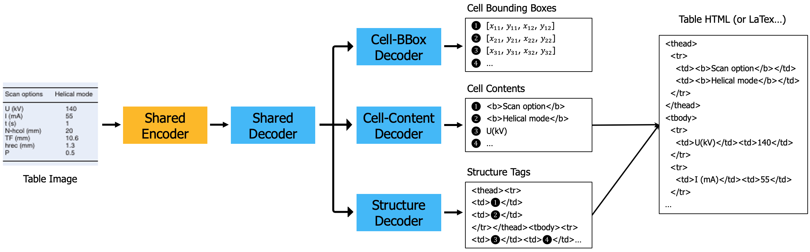

  <h1 align="left">MTL-TabNet: Multi-task Learning based Model for Image-based Table Recognition</h1>


<!-- TABLE OF CONTENTS -->

<details open="open">
  <summary><h2 style="display: inline-block">Contents</h2></summary>
  <ol>
    <li>
      <a href="#about-the-project">About The Project</a>
      <ul>
        <li><a href="####Method-description">Method Description</a></li>
        <li><a href="#Dependency">Dependency</a></li>
      </ul>
    </li>
    <li>
      <a href="#getting-started">Getting Started</a>
      <ul>
        <li><a href="#prerequisites">Prerequisites</a></li>
        <li><a href="#installation">Installation</a></li>
      </ul>
    </li>
    <li>
      <a href="#usage">Usage</a>
      <ul>
        <li><a href="#data-preprocess">Data preprocess</a></li>
        <li><a href="#train">Train</a></li>
        <li><a href="#inference">Inference</a></li>
        <li><a href="#get-teds-score">Get TEDS score</a></li>
      </ul>
     </li>
    <li><a href="#result">Result</a></li>
    <li><a href="#pretrained-model">Pretrained model</a></li>
    <li><a href="#license">License</a></li>
    <li><a href="#acknowledgements">Acknowledgements</a></li>
  </ol>
</details>


<!-- ABOUT THE PROJECT -->

## About The Project

This project is the implementation of MTL-TabNet (Multi-task Learning based Model for Image-based Table Recognition) based on the repository of [TableMASTER-mmocr](https://github.com/JiaquanYe/TableMASTER-mmocr) (Thank you very much for your excellent works).

### Method Description

The proposed model consists of one shared encoder, one shared decoder, and three separate decoders for three sub-tasks of the table recognition problem as shown in Fig. 1. The shared encoder encodes the input table image as a sequence of features. The sequence of features is passed to the shared decoder and then the structure decoder to predict a sequence of HTML tags that represent the structure of the table. When the structure decoder produces the HTML tag representing a new cell (‘<td>’ or ‘<td ...’), the output of the shared decoder corresponding to that cell and the output of the shared encoder are passed into the cell-bbox decoder and the cell-content decoder to predict the bounding box coordinates and the text content of that cell. Finally, the text contents of cells are inserted into the HTML structure tags corresponding to their cells to produce the final HTML code of the input table image. 




### Dependency

* [MMOCR-0.2.0](https://github.com/open-mmlab/mmocr/tree/v0.2.0)
* [MMDetection-2.11.0](https://github.com/open-mmlab/mmdetection/tree/v2.11.0)
* [mmcv-full-1.3.4](https://github.com/open-mmlab/mmcv/tree/v1.3.4)


<!-- GETTING STARTED -->

## Getting Started

### Prerequisites

* About **PubTabNet**, click [here](https://developer.ibm.com/exchanges/data/all/pubtabnet/) for downloading, and check their [github](https://github.com/ibm-aur-nlp/PubTabNet) and [paper](https://arxiv.org/abs/1911.10683) for the details.
* About **FinTabNet**, click [here](https://developer.ibm.com/data/fintabnet/) for downloading the dataset and use [extract_table_images_FinTabNet.py](https://github.com/namtuanly/MTL-TabNet/blob/main/tools/data/fintabnet/extract_table_images_FinTabNet.py) to extract table images and the annotation file (like PubTabNet).
* About the metric **TEDS**, see [github](https://github.com/ibm-aur-nlp/PubTabNet/tree/master/src) 

### Installation

1. Install mmdetection. click [here](https://github.com/open-mmlab/mmdetection/blob/v2.11.0/docs/get_started.md) for details.
   
   ```sh
   # We embed mmdetection-2.11.0 source code into this project.
   # You can cd and install it (recommend).
   cd ./mmdetection-2.11.0
   pip install -v -e .
   ```
   
2. Install mmocr. click [here](https://github.com/open-mmlab/mmocr/blob/main/docs/install.md) for details.

   ```sh
   # install mmocr
   cd {Path to MTL-TabNet}
   pip install -v -e .
   ```

3. Install mmcv-full-1.3.4. click [here](https://github.com/open-mmlab/mmcv) for details.

   ```sh
   pip install mmcv-full=={mmcv_version} -f https://download.openmmlab.com/mmcv/dist/{cu_version}/{torch_version}/index.html
   
   # install mmcv-full-1.3.4 with torch version 1.8.0 cuda_version 10.2
   pip install mmcv-full==1.3.4 -f https://download.openmmlab.com/mmcv/dist/cu102/torch1.8.0/index.html
   ```


<!-- USAGE EXAMPLES -->

## Usage

### Data preprocess

Run [data_preprocess.py](./table_recognition/data_preprocess.py) to get valid train data. Remember to change the **'raw_img_root'** and **‘save_root’** property of **PubtabnetParser** to your path.

```shell
python ./table_recognition/data_preprocess.py
```

It will about 8 hours to finish parsing 500777 train files. After finishing the train set parsing, change the property of **'split'** folder in **PubtabnetParser** to **'val'** and get formatted val data.

Directory structure of parsed train data is :

```shell
.
├── StructureLabelAddEmptyBbox_train
│   ├── PMC1064074_007_00.txt
│   ├── PMC1064076_003_00.txt
│   ├── PMC1064076_004_00.txt
│   └── ...
├── recognition_train_img
│   ├── 0
│       ├── PMC1064100_007_00_0.png
│       ├── PMC1064100_007_00_10.png
│       ├── ...
│       └── PMC1064100_007_00_108.png
│   ├── 1
│   ├── ...
│   └── 15
├── recognition_train_txt
│   ├── 0.txt
│   ├── 1.txt
│   ├── ...
│   └── 15.txt
├── structure_alphabet.txt
└── textline_recognition_alphabet.txt
```


### Train

Train multi-task learning based table recognition model with **MTL-TabNet**.

   ```shell
   sh ./table_recognition/expr/table_recognition_dist_train.sh
   ```

### Inference

To get final results.

   ```shell
   python ./table_recognition/run_table_inference.py
   ```

   [run_table_inference.py](./table_recognition/run_table_inference.py) will call [table_inference.py](./table_recognition/table_inference.py) and use multiple gpu devices to do model inference. Before running this script, you should change the value of **cfg** in [table_inference.py](./table_recognition/table_inference.py) .

   Directory structure of table recognition results are:

   ```shell
   # If you use 8 gpu devices to inference, you will get 8 detection results pickle files, one end2end_result pickle files and 8 structure recognition results pickle files. 
   .
   ├── structure_master_caches
   │   ├── structure_master_results_0.pkl
   │   ├── structure_master_results_1.pkl
   │   ├── ...
   │   └── structure_master_results_7.pkl
   ```

### Get TEDS score

1. Installation.

   ```shell
   pip install -r ./table_recognition/PubTabNet-master/src/requirements.txt
   ```

2. Get **gtVal.json**.

   ```shell
   python ./table_recognition/get_val_gt.py
   ```

3. Calcutate TEDS score. Before run this script, modify pred file path and gt file path in [mmocr_teds_acc_mp.py](./table_recognition/PubTabNet-master/src/mmocr_teds_acc_mp.py)

   ```shell
   python ./table_recognition/PubTabNet-master/src/mmocr_teds_acc_mp.py
   ```

   

<!-- Result -->

## Result


**TEDS score**

|                         Datasets                        |   TEDS (%) | TEDS-struct. (%) |
| :-----------------------------------------------------: | :--------: | :--------:       |
|                 FinTabNet                               |      -     |   98.79          |
|                 PubTabNet                               |    96.67   |   97.88          |


<!-- Pretrain Model -->

## Pretrained Model

Pretrain model can be download in [PubTabNet](https://drive.google.com/file/d/16RlU_1373OP73AWl_L8FY46wTrqiycCi/view?usp=sharing) and [FinTabNet](https://drive.google.com/file/d/1aWo0sCyhINroRTteR4mO433lmewlWFh4/view?usp=sharing)

<!-- Demo -->
## Demo
To run demo for recognizing a table image (you can change the input file and checkpoint file in demo.py):
   ```shell
   python ./table_recognition/demo/demo.py
   ```

<!-- LICENSE -->

## License

This project is licensed under the MIT License. See LICENSE for more details.


<!-- Citations -->

## Citations

```latex
@article{visapp23namly,
   title={An End-to-End Multi-Task Learning Model for Image-based Table Recognition},
   author={Nam Tuan Ly and Atsuhiro Takasu},
   booktitle={Proceedings of the 18th International Joint Conference on Computer Vision, Imaging and Computer Graphics Theory and Applications - Volume 5: VISAPP},
   year={2023},
   pages={626-634},
   publisher={SciTePress},
   doi={10.5220/0011685000003417},
}

```


<!-- Contact -->
## Contact
Nam Ly (namly@nii.ac.jp, namlytuan@gmail.com)<br>
Atsuhiro Takasu (takasu@nii.ac.jp)


<!-- ACKNOWLEDGEMENTS -->

## Acknowledgements

* [PubTabNet](https://github.com/ibm-aur-nlp/PubTabNet)
* [OpenMMLab](https://github.com/open-mmlab)
* [TableMASTER-mmocr](https://github.com/JiaquanYe/TableMASTER-mmocr)
